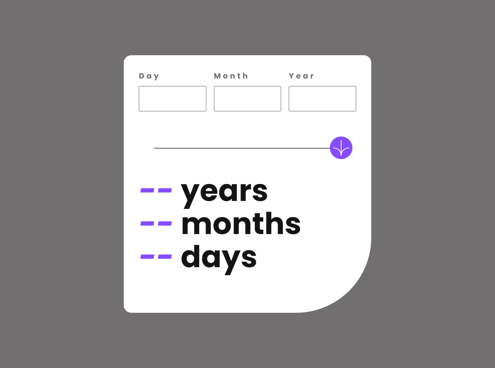
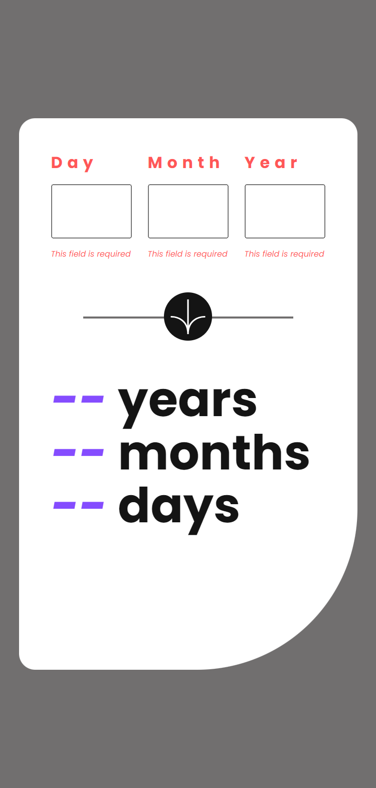
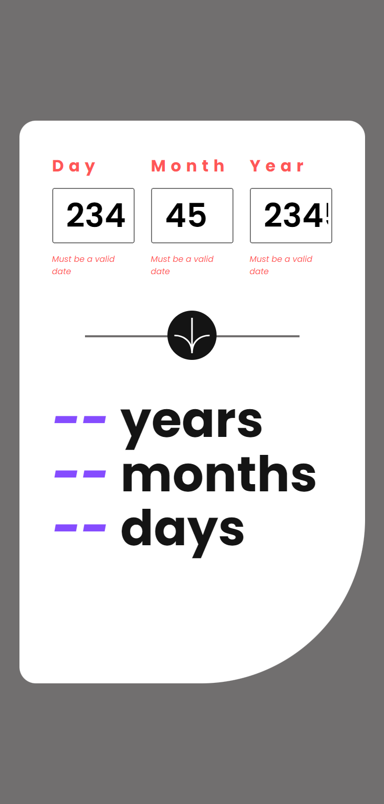
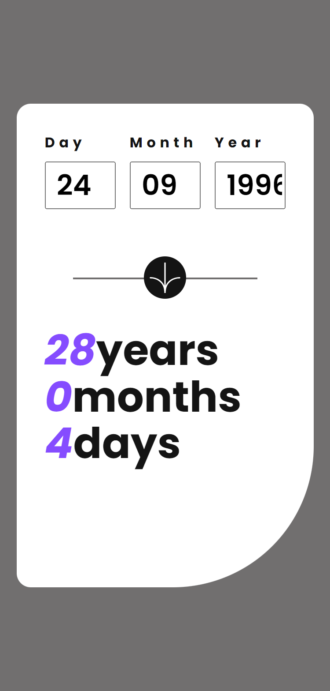

# Project Started
- Sep 27, 2024

# Project Finished
- Sep 27, 2024

# Layout
- mobile(375px)
- desktop(1440px)

# Tasks
- View an age in years, months, and days after submitting a valid date through the form
- Receive validation errors if:
  - Any field is empty when the form is submitted
  - The day number is not between 1-31
  - The month number is not between 1-12
  - The year is in the future
  - The date is invalid e.g. 31/04/1991 (there are 30 days in April)
- View the optimal layout for the interface depending on their device's screen size
- See hover and focus states for all interactive elements on the page
- **Bonus**: See the age numbers animate to their final number when the form is submitted

# Built With
- CSS Custom Properties
- Flexbox
- Grid
- JS OOP

# Snapshots

# What I larnt
- date different that could output negative and positive
- adjust date for negative values output
- aria invalid for error message