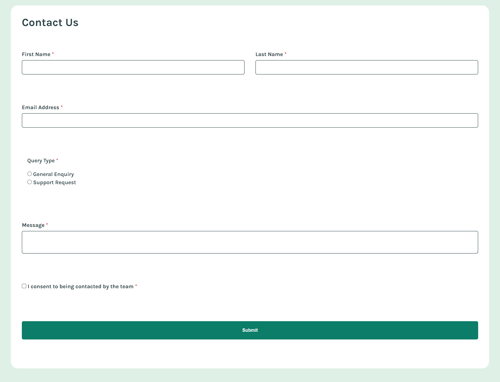
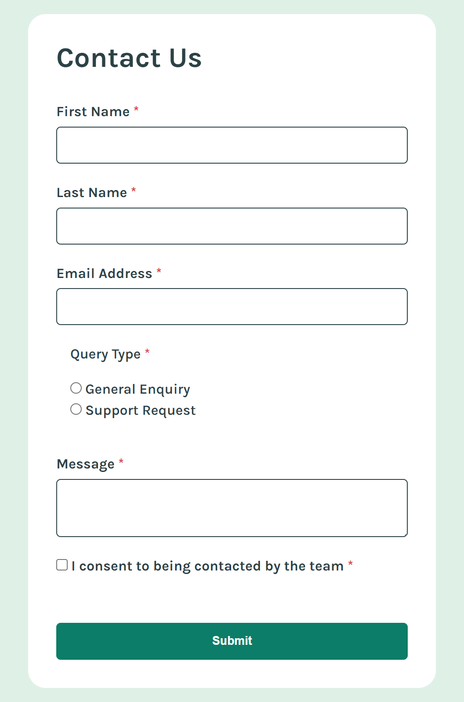
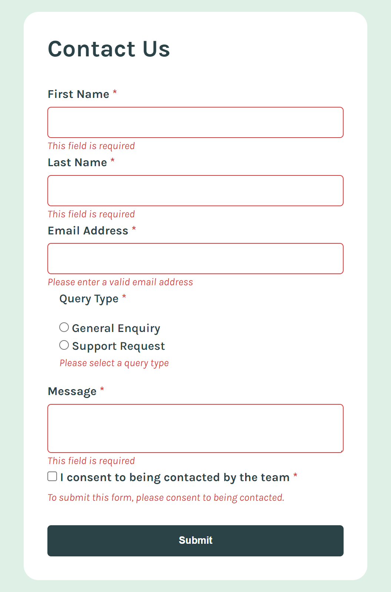

## Project Start
- Sep 11, 2024

## Project End
- Sep 11, 2024

## Layout
- mobile(375px)
- desktop(1440px)

## Snapshots

## Built With
- CSS custom Properties
- Grid
- JavaScript

## Tasks
- Complete the form and see a success toast message upon successful submission
- Receive Form validation messages if
    - A required field has been missed
    - The email address is not formatted correctly
- Complete the form only using their keyboard
- Have inputs, error messages, and the sucess message announced on their screen reader
- View the optimal layout for the interface depending on their device's screen size
- Hover and focus states 