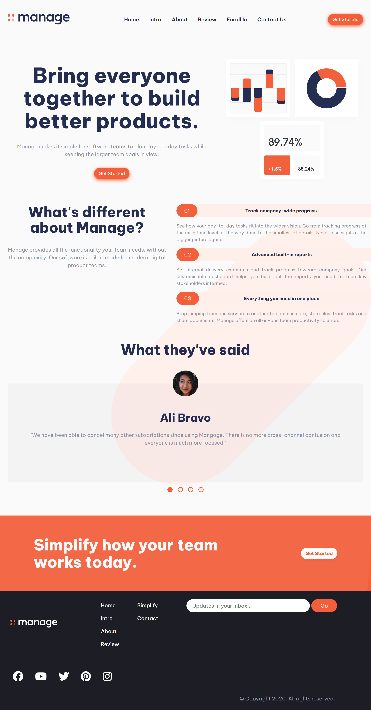
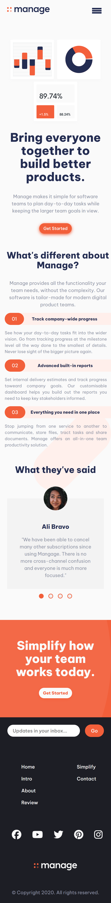

# Project Started
- Sep 28, 2024

# Project Ended
- Sep 29, 2024

# Tasks
- View the optimal layout for the site depending on their device's screen size
- See hover states for all interactive elements on the page
- See all testimonials in a horizontal slider
- Receive an error message when the newsletter sign up `form` is submitted if:
  - The `input` field is empty
  - The email address is not formatted correctly

# Layout
- mobile(375px)
- desktop(1440px)

# Built With
- CSS Custom Properties
- Flexbox
- Grid
- JS OOP

# What I Learnt
- clip-path animation with JS
- preventDefault() on anchors will stop to go to the content
- tab button to each review container

# Snapshots

